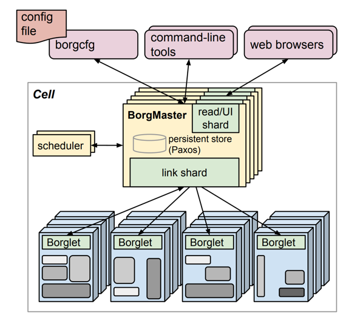

## **k8s起源**
k8s源自谷歌Borg系统，要想理解k8s不得不了解Borg。

```
Borg的paper文档：
http://static.googleusercontent.com/media/research.google.com/zh-CN//pubs/archive/43438.pdf
中文翻译：
https://zhuanlan.zhihu.com/p/55970564
```

Borg的最大特性是：

- 物理资源利用率高
- 服务器共享，进程级别隔离
- 高可用，故障恢复时间短
- 调度策略灵活等
- 一个集群可以管理数万台服务器

此外，Borg将资源划分成在线任务和离线任务2种，在线任务在资源不足时可以抢占离线任务资源，在集群资源充足时离线任务可以继续跑任务，这样可以提升资源利用率。

## **Borg架构**


Borg架构和k8s架构很像，但也有差别，如：

- Borg的存储用的是Paxos协议，该协议较复杂；k8s存储（etcd）用的是raft协议，该协议相对简单；
- 1个Borg集群称呼cell；1个k8s集群称呼cluster等；
- 单个Borg集群可以管理数万台服务器，而单个k8s集群最多只能管理5000台机器，虽然有些云厂商对k8s集群做了优化可以管理数万台机器，其改造后的k8s管理规模仍然不及Borg；
- Borg对服务器管理的资源使用率超高（据说达到了60%+），k8s对机器的管理资源率不高，不过可以借助生态组件提升该能力。
- ...

